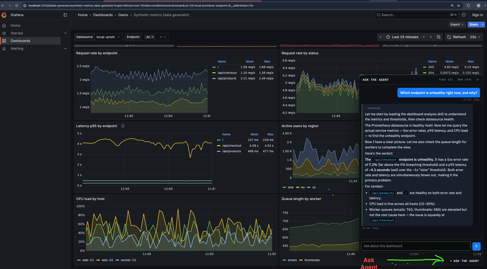
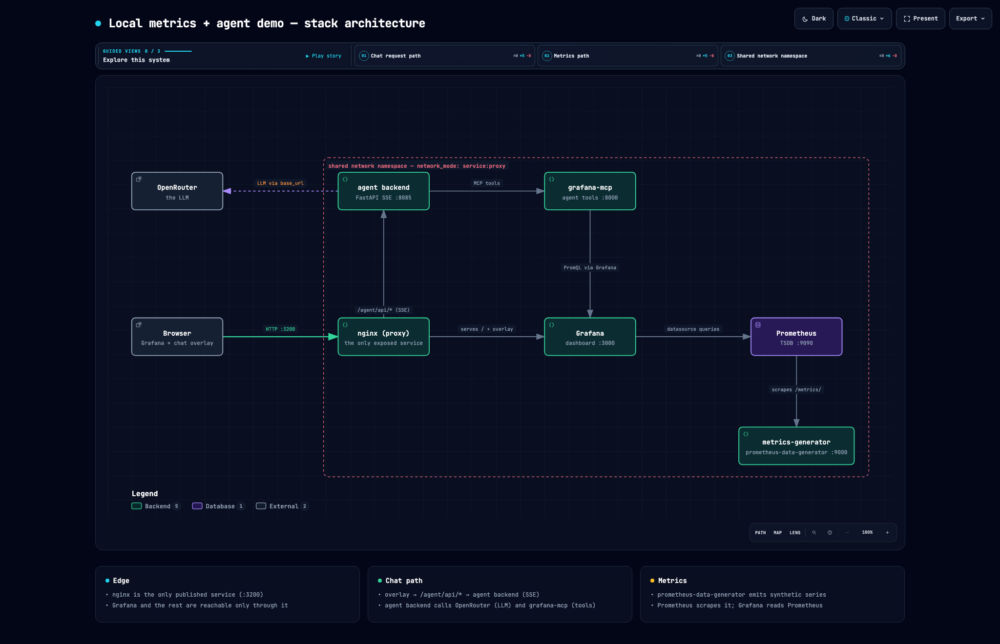

# Grafana with an injected metrics agent

A local Grafana demo with a chat box added to the page. Ask the agent a question
and it queries the live metrics before answering:

> Which endpoint is unhealthy right now, and why?

Grafana is not modified or forked. nginx (the `proxy` service) sits in front of
the stock image and injects one JavaScript file. The agent uses OpenRouter for
the model and Grafana MCP (Model Context Protocol) to reach Grafana and
Prometheus.



## Run it

Docker is required. An [OpenRouter](https://openrouter.ai/) API key is needed
only for agent responses; Grafana, Prometheus, and the generated metrics work
without one.

```bash
cp .env.example .env
```

Put your key in `.env`:

```dotenv
OPENROUTER_API_KEY=sk-or-your-key
```

Start everything:

```bash
docker compose up -d
```

Open <http://127.0.0.1:3200> (Prometheus is at <http://127.0.0.1:9091>). Click the
chat button in the bottom-right corner to open the chat box. Grafana can be viewed
anonymously; the default admin login is `admin` / `admin` unless you change it in
`.env`.

The dashboard uses live synthetic data, so wait a minute after the first start
before asking about rates or latency. The answer to the question above should
point to `/api/checkout`, which produces 500 errors and is slower than the other
endpoints.

## How it works

[](docs/architecture.html)

For the interactive version with guided views, open
[`docs/architecture.html`](docs/architecture.html) locally after cloning.

When you ask a question:

1. nginx serves Grafana and injects `nginx/overlay.js` before the closing
   `</body>` tag.
2. The overlay POSTs the question to `/agent/api/chat`.
3. nginx forwards the request to the FastAPI agent backend.
4. The agent activates the `dashboard-analysis` skill and invokes Grafana MCP
   tools to query live metrics.
5. FastAPI streams the answer back to the chat box as server-sent events (SSE).

If the agent is unavailable, Grafana still works; the dashboard route does not
depend on it.

## What is in the project

| Path | Purpose |
|---|---|
| `docker-compose.yml` | Starts the full demo |
| `nginx/nginx.conf` | Proxies Grafana, injects the overlay, and forwards chat requests |
| `nginx/overlay.js` | Chat button, panel, browser state, and streamed response handling |
| `agent/agent.py` | FastAPI + Strands + Grafana MCP backend |
| `agent/skills/dashboard-analysis/SKILL.md` | Skill with metric names, PromQL, and health thresholds |
| `config/data-generator.yml` | Defines the synthetic metrics |
| `config/prometheus.yml` | Tells Prometheus what to scrape |
| `config/grafana-datasources.yaml` | Creates the `local-prom` datasource |
| `config/grafana-dashboards.yaml` | Loads dashboards from the repository |
| `dashboards/data-generator.json` | The Grafana dashboard |

## Quick checks

Check that the overlay was added to Grafana:

```bash
curl -s http://127.0.0.1:3200/login \
  | grep -o '<script src="/agent/overlay.js"[^>]*>'
```

Check the FastAPI agent and its Grafana MCP tools:

```bash
curl -s http://127.0.0.1:3200/agent/api/health
```

A healthy response has `"ok": true` and a positive `"tools"` count. `"tools": 0`
means the agent did not connect to MCP.

## Common problems

| Problem | What to do |
|---|---|
| Chat reports a 401 error | Put a real `OPENROUTER_API_KEY` in `.env`, then run `docker compose up -d agent`. |
| Health shows `"tools":0` | Run `docker compose restart agent` after Grafana MCP is ready. |
| The chat button is missing | Open the proxy at port `3200` and check that the `proxy` service is running. |
| The dashboard is empty | Wait a minute for Prometheus to collect live samples. |
| A port is already in use | Change `HOST_PORT` or `PROM_PORT` in `.env`. |
| The model gives weak tool answers | Try another `OPENROUTER_MODEL` in `.env`. |

View service status with `docker compose ps` and agent logs with
`docker compose logs -f agent`.

## Stop it

Stop the containers but keep Grafana and Prometheus data:

```bash
docker compose down
```

Stop everything and delete the saved data:

```bash
docker compose down -v
```
